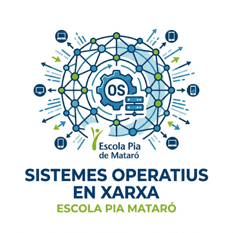

# 0224 Sistemes Operatius en Xarxa

Repositori del mòdul 0224 Sistemes Operatius en Xarxa del cicle formatiu de grau mitjà Sistemes Microinformàtics i Xarxes a Escola Pia de Mataró.

Professors:

- Carlos Alonso Martínez
- Carles Fugarolas

## Continguts destacats

- [Programació del mòdul](https://github.com/SMX-SOX/programacio)
